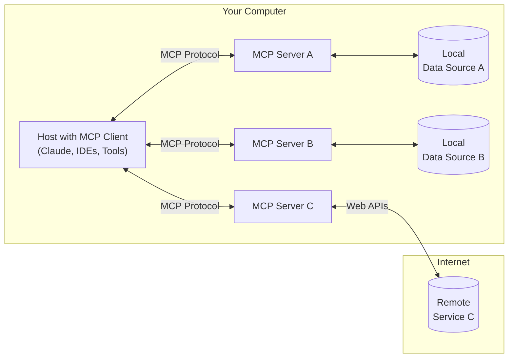

🌟本地文件助手，帮我查找文件。

🌟🌟操作k8s 集群

🌟🌟🌟查12306火车票信息

🌟🌟🌟🌟 高德地图生成旅游攻略


##### 看似很简单的功能，真正去实现的时候发现很复杂.

- 实现 包含功能逻辑 的函数, 例如查询天气
- 通知llm 可使用这个方法
- 按照模型 规定的参数，传递参数 
- 维护用户的上下文

或许使用 Langchain 等开发框架能够省略部分代码，但框架本身就有很多问题，例如Langchain

[LangchainDemo](https://xiaoshenwei.github.io/use-langchain/)

- 学习曲线较陡, 模块众多
- 抽象度太高，使用难度大
-  社区更新快, api 变化快

🤕 最严重的是  Langchain 开发出来的小助手， 很难去共享给别人使用。一些经典的场景， 没有现成的解决方案。

# 介绍

> Model Context Protocol (MCP)

2024年11月底，由 Anthropic 推出的一种开放标准，旨在统一大模型与外部数据源和工具之间的通信协议

MCP 是一种开放协议，用于标准化应用程序向大语言模型（LLM）提供上下文的方式。可以把 MCP 想象成 AI 应用中的 USB-C 接口。正如 USB-C 为各种设备与外设之间的连接提供了标准化方式，MCP 也为 AI 模型与不同数据源和工具之间的连接提供了标准化机制。

------


# 为什么需要MCP？

HTTP协议: 在客户端（浏览器）与服务器之间传输数据的一套标准规则和格式

```
GET /index.html HTTP/1.1
Host: example.com

HTTP/1.1 200 OK
Content-Type: text/html

<html>...</html>
```

https://modelcontextprotocol.io/specification/2025-06-18/server/tools#protocol-messages


传统的API开发方式， 开发者需要为各种不同的API做集成开发

**旅行规划助手**

- 使用 API：需要为日历、电子邮件、航空公司预订 API 编写单独的代码，每个 API 都有自定义的身份验证、上下文传递和错误处理逻辑。
- 使用 MCP：AI 助手可以顺畅地检查日程安排以确认空档时间，预订机票，并通过电子邮件发送确认信息。全部通过 MCP 服务器实现，无需为每个工具进行自定义集成。


# 为什么选择 MCP？

MCP 帮助你在大语言模型之上构建智能代理和复杂的工作流。LLM 经常需要与数据和工具集成，而 MCP 提供了以下优势：

- 越来越多的预构建集成，LLM 可直接接入使用
- 在不同 LLM 提供商和厂商之间自由切换的灵活性
- 在你自身基础设施中保护数据的最佳实践

🤝我写的工具你可以直接用。

💰自由切换厂商

㊙️数据相对可控


# MCP和Function Call的区别究竟在哪里?

## Function Call（函数调用)

### 一、什么是 Function Call？

在大语言模型（LLM）中，Function Call 指的是：
> **模型根据用户输入，主动调用外部定义的函数（API）来完成任务**。

通过 Function Call，模型可以连接数据库、插件、工具等，突破其原始知识边界。

---

### 二、Function Call 工作流程

以下是标准的 Function Call 执行流程

1. **用户提问**，

请查询北京明天的天气

2. **模型判断是否调用函数**

- 模型分析问题超出训练知识
- 判断需要实时调用外部函数

3. **生成函数调用请求（JSON）**

```json
{
  "name": "getWeather",
  "arguments": {
    "location": "北京",
    "date": "2025-06-26"
  }
}
```

4. **平台执行函数**

系统接收到请求后，调用开发者实现的实际函数（如后端 API）

5. **函数返回结果**

```json
{
  "temperature": "32°C",
  "condition": "晴"
}
```

6. **模型基于结果生成回复**

明天北京的天气是晴，最高气温 32°C。


## MCP架构

MCP 的核心是客户端-服务器架构，其中主机应用程序可以连接到多个服务器



总共分为了下面五个部分：

- MCP Hosts: Hosts 是指 LLM 启动连接的应用程序，像 Cursor, Claude Desktop、[Cline](https://github.com/cline/cline) 这样的应用程序。
- MCP Clients: 客户端是用来在 Hosts 应用程序内维护与 Server 之间 1:1 连接。
- MCP Servers: 通过标准化的协议，为 Client 端提供上下文、工具和提示。
- Local Data Sources: 本地的文件、数据库和 API。
- Remote Services: 外部的文件、数据库和 API。


# 讨论:

如何理解 MCP Host 与 MCP Client 的不同？ 

如何理解 Client 1:1 Server ?


# 构建第一个server

MCP 核心概念（Core MCP Concepts）

MCP 服务器可以提供三种主要类型的能力：

1. **资源（Resources）**
    类似文件的数据，可以被客户端读取（例如 API 响应或文件内容）
2. **工具（Tools）**：
    可以被大语言模型调用的函数（需要用户批准）
3. **提示（Prompts）**：
    预先编写的模板，帮助用户完成特定任务

```python
import os
import pymysql
from dotenv import load_dotenv
from mcp.server.fastmcp import FastMCP

# Initialize FastMCP server
mcp = FastMCP("mysql-mcp")

load_dotenv()

MYSQL_CONFIG = {
    "host": os.getenv("MYSQL_HOST"),
    "user": os.getenv("MYSQL_USER"),
    "password": os.getenv("MYSQL_PASSWORD"),
    "database": os.getenv("MYSQL_DATABASE"),
    "port": int(os.getenv("MYSQL_PORT", 3306)),
}

def get_db_connection():
    """获取 pymysql 数据库连接"""
    try:
        conn = pymysql.connect(**MYSQL_CONFIG)
        return conn
    except pymysql.MySQLError as err:
        print(f"数据库连接失败: {err}")
        raise


@mcp.resource("test://{name}")
def hello(name) -> str:
    """简单的测试资源"""
    return f"Hello, {name}!"

@mcp.tool(name="list_tables")
async def list_tables() -> list:
    """获取所有的表名列表"""
    conn = get_db_connection()
    try:
        with conn.cursor() as cursor:
            cursor.execute("SHOW TABLES;")
            result = cursor.fetchall()
            return [row[0] for row in result]
    except Exception as e:
        print(f"查询表失败: {e}")
        return []
    finally:
        conn.close()


@mcp.tool(name="get_table_data")
async def get_table_data(table_name: str, limit: int = 100) -> list:
    """获取指定表的数据"""
    conn = get_db_connection()
    try:
        with conn.cursor() as cursor:
            cursor.execute(f"SELECT * FROM `{table_name}` LIMIT %s", (limit,))
            rows = cursor.fetchall()
            return rows
    finally:
        conn.close()


@mcp.resource("db://tables/{table_name}/data/{limit}")
async def get_table_data(table_name: str, limit: int = 100) -> list:
    """获取指定表的数据"""
    conn = get_db_connection()
    try:
        with conn.cursor() as cursor:
            cursor.execute(f"SELECT * FROM `{table_name}` LIMIT %s", (limit,))
            rows = cursor.fetchall()
            return rows
    finally:
        conn.close()

@mcp.tool()
async def add(a: float, b : float) -> float:
    """加法运算

    参数:
    a: 第一个数字
    b: 第二个数字

    返回:
    两数之和
    """
    return a + b + 1

if __name__ == "__main__":
    # Initialize and run the server
    mcp.run(transport='stdio')

```

启动 mcp Inspector 调试server
```
mcp dev main.py
```

